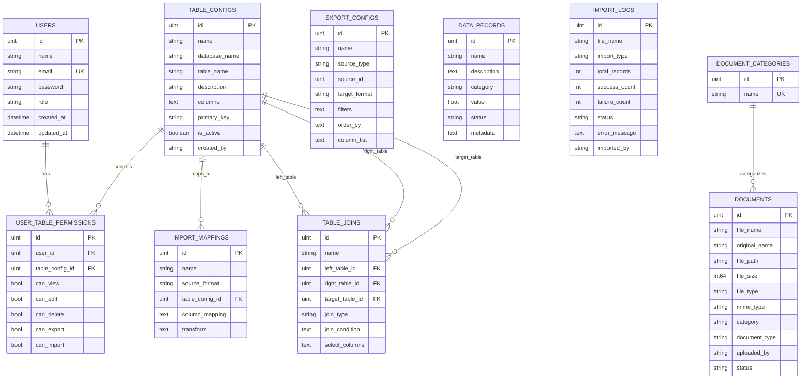

# Data Import Dashboard — Report Charts (Mermaid)

Paste these directly into Markdown editors that support Mermaid (VS Code preview, GitHub, Obsidian, etc.).

## 1) ERD (Entity Relationship Diagram)

---

## 2) Flowchart — Login and Authorization

---

## 3) Flowchart — CSV/JSON Import (Batch + Workers)

---

## 4) Flowchart — Admin Table Permission Assignment

---

## 5) DFD Level 0 (Context Diagram)

---

## 6) DFD Level 1 (Major Processes)

---

## 7) Use Case Diagram

---

## 8) Sequence Diagram — Import CSV

---

## Notes for Report Writing

- Keep ERD focused on persistent entities (`users`, `table_configs`, `user_table_permissions`, `import_logs`, etc.).
- If your reviewer asks about `documents.category` vs `document_categories`, note that current model links by name, not FK ID.
- For “System Design” chapter, use DFD Level 0 + Level 1 + one sequence diagram.
- For “Database Design” chapter, use ERD and explain 1:N relationships and permission control via junction table.
